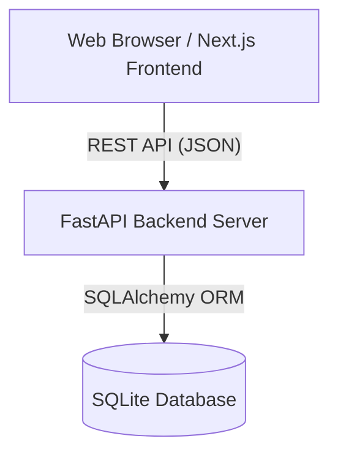

<div align="center">
  
  <h1>Typeform Builder Clone</h1>
  <p>A pixel-perfect, highly dynamic, and full-stack implementation of a conversational form builder.</p>

  <p>
    
    
    
    
  </p>
</div>

---

## ✨ Features

- **Dynamic Form Builder**: Drag-and-drop interface for ordering questions, real-time live preview, and seamless state management.
- **Respondent Flow**: Conversational, one-question-at-a-time live form filling with keyboard hotkeys, validation, and auto-scrolling.
- **Analytics Dashboard**: Inspect results, manage form lifecycles (Draft/Publish), and share unique URLs.
- **Pixel-Perfect UI**: Glassmorphism, tailored animations (via Anime.js), continuous marquees, and a dark-mode-first aesthetic identical to modern SaaS tools.
- **Dockerized**: Lightning-fast setup with a single command.

---

## 🚀 Setup Instructions

This project is fully containerized with Docker, making setup a breeze.

### Prerequisites
- [Docker Desktop](https://www.docker.com/products/docker-desktop/) or Docker Engine installed on your machine.
- Git.

### 1. Clone the repository
```bash
git clone https://github.com/yourusername/typeform-builder-clone.git
cd typeform-builder-clone
```

### 2. Build and Start the Application
Simply run the following command in the root directory:

```bash
docker compose up --build
```

That's it! 
- The **Frontend** will be available at `http://localhost:3000`
- The **Backend / Swagger UI** will be available at `http://localhost:8000/docs`

*(The database is automatically seeded with demo data upon first startup!)*

---

## 🏗 Architecture Overview

The application utilizes a modern decoupled client-server architecture:



### Frontend (`/frontend`)
- **Framework**: Next.js 14 (App Router)
- **Styling**: Tailwind CSS v4 with custom CSS keyframe animations and glassmorphism utilities.
- **State Management**: React Hooks (`useState`, `useEffect`, `useRef`) combined with optimistic UI updates.
- **Drag and Drop**: `@dnd-kit/core` for seamless and accessible question reordering.
- **Animations**: `animejs` for staggered entry effects, and Canvas Confetti for celebratory success states.

### Backend (`/backend`)
- **Framework**: FastAPI (Python)
- **Database Engine**: SQLite (via SQLAlchemy)
- **CORS & Routing**: Fully configured for cross-origin requests from the frontend container.
- **Design Pattern**: Controller-Service-Repository pattern with strict Pydantic models for request/response validation.

---

## 🗄 Database Schema

The relational database strictly enforces data integrity across four main tables:

### `forms`
The core entity representing a created form.
- `id` (UUID, Primary Key)
- `title` (String, e.g., "Customer Survey")
- `description` (Text, optional)
- `status` (String: 'draft' or 'published')
- `share_slug` (String, Unique) - *Used for the public respondent link*

### `questions`
Questions linked to a specific form.
- `id` (UUID, Primary Key)
- `form_id` (UUID, Foreign Key -> forms.id)
- `order_index` (Integer) - *Used to sort questions in the builder/flow*
- `question_type` (String) - *short_text, long_text, multiple_choice, dropdown, email, number, yes_no, rating*
- `title` (Text)
- `is_required` (Boolean)
- `options_json` (Text) - *Stores multiple-choice options as a JSON array*

### `responses`
A single submission from a respondent.
- `id` (UUID, Primary Key)
- `form_id` (UUID, Foreign Key -> forms.id)
- `submitted_at` (DateTime)

### `answers`
The individual answers tied to a specific response and question.
- `id` (UUID, Primary Key)
- `response_id` (UUID, Foreign Key -> responses.id)
- `question_id` (UUID, Foreign Key -> questions.id)
- `answer_text` (Text) - *The actual text/value submitted by the user*

---

## 📡 API Overview

The FastAPI backend exposes the following RESTful endpoints. You can explore and test them interactively via Swagger UI at `http://localhost:8000/docs`.

### Forms
- `GET /api/forms` - List all forms with question/response counts.
- `POST /api/forms` - Create a new empty form.
- `GET /api/forms/{form_id}` - Retrieve full form details including all questions.
- `PUT /api/forms/{form_id}` - Update form title/description.
- `DELETE /api/forms/{form_id}` - Delete a form and cascade delete its questions/responses.
- `POST /api/forms/{form_id}/duplicate` - Deep-copy a form and its questions.
- `POST /api/forms/{form_id}/toggle-publish` - Toggle between `draft` and `published` states.

### Questions
- `POST /api/forms/{form_id}/questions` - Add a new question to a form.
- `PUT /api/questions/{question_id}` - Update a question's type, title, requirements, or options.
- `DELETE /api/questions/{question_id}` - Remove a question.
- `POST /api/forms/{form_id}/questions/reorder` - Update the `order_index` for a list of question IDs (used by drag-and-drop).

### Respondent & Results
- `GET /api/public/forms/{slug}` - Fetch a published form's details using its public share slug.
- `POST /api/public/forms/{slug}/submit` - Submit answers to a public form.
- `GET /api/forms/{form_id}/results` - Fetch aggregate analytics and individual submission records for a specific form.
